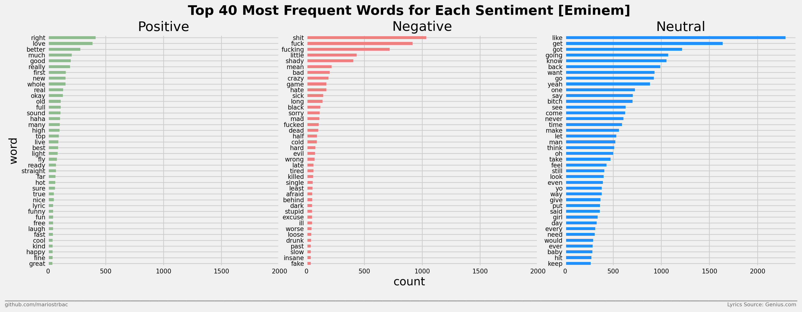
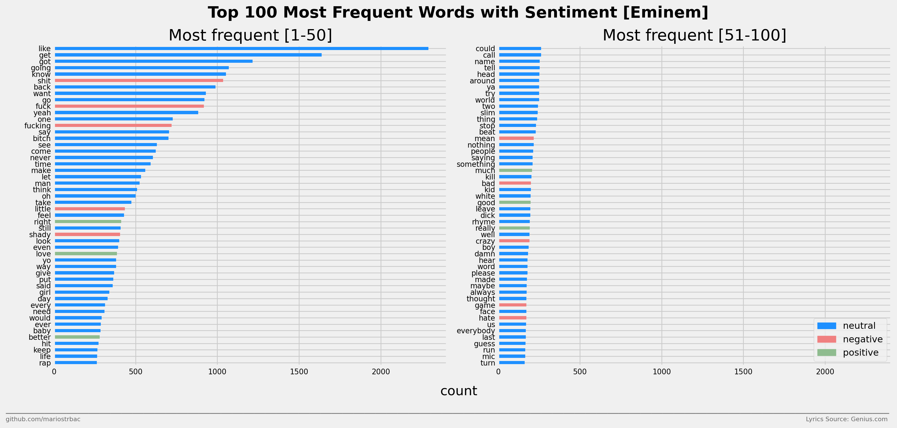
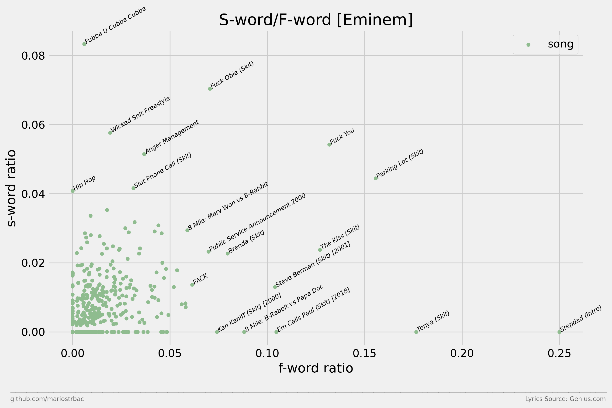
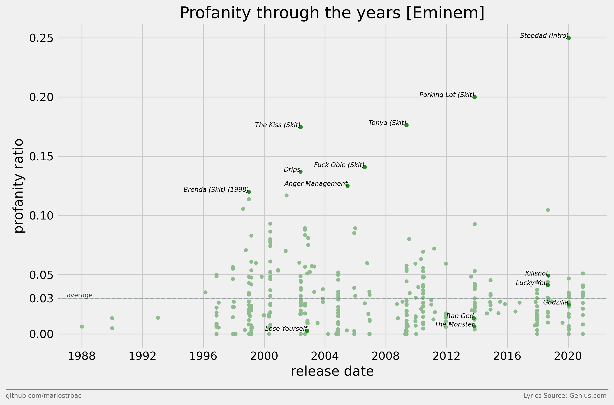
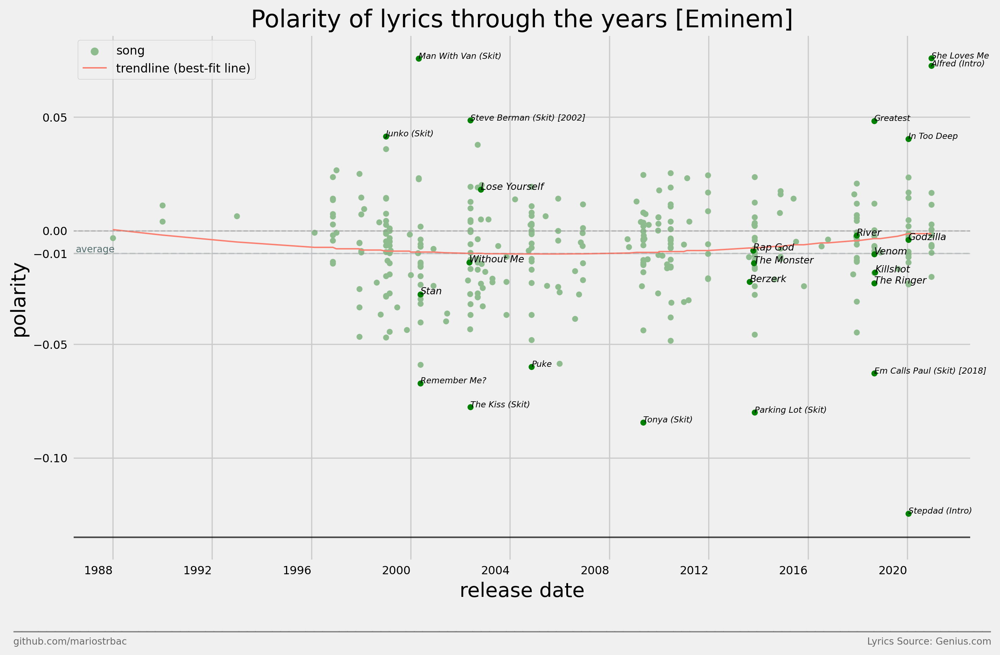
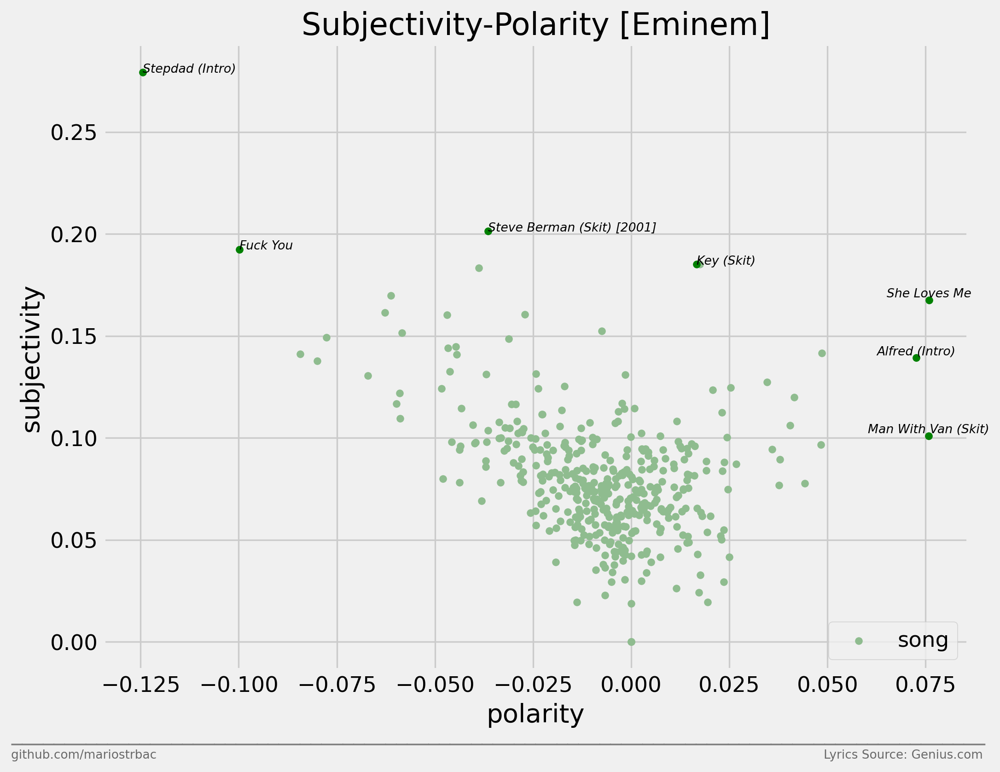

<h1> Eminem Lyrics Generator using GPT-2 and RNNs </h1>

The main idea of the project was to build a machine learning model that can generate new and unique text while mimicking the style of the source it was trained on. For this purpose, Eminem's song lyrics were selected, as well as two popular machine learning models for text generation. Both models are constructed to generate lyrics from an initial prompt, or in this case a title of the song, and then, hopefully, to follow the given topic and the standard structure of Eminem's songs. In addition to the generation of lyrics, the preprocessing and analysis of text data are performed as well. 

The project consists of multiple Jupyter notebook files, each notebook file for a different step in the project. It starts with collecting Eminem's lyrics using Genius API, cleaning the data and doing simple data analysis, mainly centered around the structure of songs, along with sentiment and profanity analysis. After cleaning and exploring the data, the final step is the generation of lyrics using RNN and GPT-2 models with Eminem's lyrics.

To reproduce the results obtained in the project, you can run the notebooks 3-4 with predefined hyperparameters and use the cloud GPU in Google Colab to train the models.

Some of the generated lyrics can be seen in the [Generated Lyrics](#generated-lyrics) section, as well as in the project's [`reports/generated_lyrics`](./reports/generated_lyrics/) folder.

In summary, the following can provide a simple introduction to the fields of Data Science and Machine Learning, while focusing on Exploratory Data Analysis and Text Generation using TensorFlow and the [gpt-2-simple](https://github.com/minimaxir/gpt-2-simple) package.

## Topics
* Data Science
* Natural Language Processing
* Data Collection
* Exploratory Data Analysis
* Machine Learning
* Transfer Learning
* GPT-2
* Recurrent Neural Network
* Text Generation

## Technologies
* Python
* TensorFlow 
* gpt-2-simple
* NumPy, Pandas, Matplotlib
* NLTK, TextBlob, PyEnchant
* Genius API (lyricsgenius)
* Jupyter Notebook, Google Colab
 <br><br>

> **Disclaimer**
> 
> The content of Eminem's lyrics was not filtered in any way, therefore the generated lyrics may contain words or language that are considered profane, vulgar, violent, or offensive. They do not represent my personal views, nor do I endorse them in any way.


<h1> Table Of Contents </h1>

- [Project Organization](#project-organization)
- [Dataset Description](#dataset-description)
- [Exploratory Data Analysis](#exploratory-data-analysis)
- [Generated Lyrics](#generated-lyrics)
- [References](#references)

# Project Organization

The project organization is derived from the [cookiecutter data science](https://github.com/drivendata/cookiecutter-data-science) project structure and modified for the purposes of this project.


    ├── data
    │   ├── processed      <- The final, processed data
    │   └── raw            <- The original, collected and unprocessed data
    │
    ├── docs               <- Media materials used in README.md
    │
    ├── models             <- The folder where trained models will be stored
    │
    ├── notebooks          <- Jupyter notebooks
    │
    ├── reports            <- Generated analysis as JPEG, TXT, etc
    │   └── figures        <- Generated graphics and figures from the analysis
    |   └── gen_lyrics     <- Lyrics generated with trained models
    |   └── contractions   <- The most common contractions extracted from the corpus


# Dataset Description

The data is collected with Genius API and stored into two similar datasets. The only difference is that one is only composed of song lyrics data, whereas the other includes non-song lyrics data (like skits from albums, freestyles, unreleased snippets, etc) as well. Both datasets have the following features:
 	 	 	 	 	 	 	 	 	 	 	 	
| Feature | Description |
|-|-|
| `song_id` | Genius song ID |
| `state` | State of the lyrics (either "complete" or "unfinished") |
| `title` | Song title |
| `artist` | Name of the primary artist |
| `featured` | List of featured artists in the song |
| `popularity` | Popularity rank of the song |
| `album_id` | Genius album ID |
| `album_name` | Album name|
| `release_date` | Song's release date|
| `lyrics` | Song's lyrics|
| `url` |Genius lyrics page of the song|
| `comments` | List of the top 50 most voted comments on the Genius lyrics page|
| `comments_total_count` | Total number of comments on the Genius lyrics page|

<br>

Not all of the features are required to run the notebooks, but they can be still quite useful in the data analysis process, especially for gaining more information about potentially corrupted lyrics, among others.


# Exploratory Data Analysis

The analysis is performed on the extended dataset, which includes Eminem's non-song lyrics data, in addition to the song lyrics data. The dataset is collected with Genius API and cleaned beforehand. Cleaning of the data was mostly focused around the removal of non-valid songs (like unfinished lyrics, non-english lyrics, etc.) from the dataset.

The following analysis is roughly divided into three sections, including Song Structure, Vocabulary Analysis and Sentiment Analysis sections. The main idea of the analysis was to determine the average characteristics of Eminem's songs, with emphasis on structure and sentiment. Although there are different types of sentiment analysis, in this project the term refers to the process of determining whether a song or word is positive, negative or neutral.

Also, additional information and more detailed explanations from the analysis, along with the source code, can be seen in the [`third notebook`](./notebooks/3-Exploratory-Data-Analysis.ipynb). 

<h2> <b>Song Structure</b> </h2>

<h3>a) average NUMBER of: </h3>
<pre>
- <b>VERSES</b> per song: 
    - mean: <b>4.38</b>
    - std: <b>3.47</b>
- <b>LINES</b> per song:
    - mean: <b>78.34</b>
    - std: <b>54.28</b>
- <b>WORDS</b> per song:
    - mean: <b>675.10</b>
    - std: <b>403.67</b>      
- <b>CHARACTERS</b> per song:
    - mean: <b>3569.95</b>
    - std: <b>2107.80</b>
- <b>FEATURES</b> (Collaborations) per song:
    - mean: <b>0.44</b>
    - std: <b>0.81</b> 
</pre>

<h3> b) average LENGTH of:</h3>
<pre>
- <b>VERSE</b> (in lines):
    - mean: <b>22.06</b>
    - std: <b>16.00</b>
- <b>LINE</b> (in words):
    - mean: <b>9.00</b>
    - std: <b>5.67</b>
- <b>WORD</b> (in chars):
    - mean: <b>4.00</b>
    - std: <b>2.05</b>
</pre>


<h2> <b>Vocabulary Analysis</b> </h2>

<h3> <b>Most Frequent Words</b> </h3>

In **Figure 1.** and **Figure 2.**, the most frequent words are shown along with their sentiment. The sentiment for each word is calculated with the TextBlob library, which uses the WordNet database and basic operations to produce the polarity output for a word. Polarity is defined as a float which lies in the range of `[-1, 1]`, where `(0, 1]` means positive sentiment (green), `[-1, 0)` means negative sentiment (red) and `0` means neutral sentiment (blue).
<figure>
  <p align="center">
     <br>
    <b>Figure 1.</b> Top 40 most frequent words for each sentiment.
  </p>
</figure>

<figure>
  <p align="center">
     <br>
    <b>Figure 2.</b> Top 100 most frequent words with their sentiment.
  </p>
</figure>

<h3> <b>Profanity Rate</b> </h3>

In **Figure 3.** the s-word/f-word graph is shown with s-word and f-word ratios for each song. Since those are the most frequent profanity words in the corpus, the outliers on the graph can be seen as songs with the most amount of profanity. So, for example, if the f-word ratio is 0.10 that means 10% of words in the song are f-words, and similarly in the case of the s-word ratio.

<figure>
  <p align="center">
     <br>
    <b>Figure 3.</b> S-word/F-words ratios.
  </p>
</figure>

In **Figure 4.** the ratio of profanity words is shown for each song, along with their release date. The profanity words considered for the ratio are the top five most frequent profanity words found in the corpus, from the section 3.5.1 in the third notebook. So, for example, if the profanity ratio is 0.20 that means 20% of words in the song are profanity words.

<figure>
  <p align="center">
     <br>
    <b>Figure 4.</b> Profanity of songs through the years.
  </p>
</figure>


<h2> <b>Sentiment Analysis</b> </h2>

The polarity of lyrics in the following figures is calculated the same way as in the figures from the previous section, but in this case a value on the polarity axis represents the average polarity of all words in a song. Additionally, subjectivity in **Figure 6.** is calculated with the TextBlob library as well, replicating the same procedure as in the case of the polarity calculation. Subjective sentences generally refer to personal opinion, emotion or judgment, whereas objective refers to factual information. Subjectivity is also a float which lies in the range of `[0,1]`.

<figure>
  <p align="center">
     <br>
    <b>Figure 5.</b> Polarity of lyrics through the years for all songs with specified release date information.
  </p>
</figure>

<figure>
  <p align="center">
     <br>
    <b>Figure 6.</b> Subjectivity-polarity graph.
  </p>
</figure>


# Generated Lyrics

A few examples of the lyrics generated with trained RNN and GPT-2 models are shown below. The RNN model is derived from [this](https://www.tensorflow.org/tutorials/text/text_generation) TensorFlow tutorial and the GPT-2 model is trained with help of the [gpt-2-simple](https://github.com/minimaxir/gpt-2-simple) package. In both cases, the predefined hyperparameters are only slightly changed for the generation of song lyrics, therefore some additional tweaking of the hyperparameters could possibly produce even better results. However, certain interesting and fun results are still obtained, especially in the case of the GPT-2 model.

Also, the lyrics are generated with the same prefix (or title), and while GPT-2 generally manages to follow the given topic, at least for the first few lines, the RNN model is unable to do so and usually generates unrelated and noncoherent text.

For more generated lyrics with the same title, you can take a look at the files in the [`reports/generated_lyrics`](./reports/generated_lyrics/) folder or generate it yourself by running the last two notebooks (4a and 4b).

<h2> RNN </h2>

- Example 1:
  
```
[Title]
Artificial Intelligence

[Intro]
Uh, uh, uh, uh, alain, debridee
You know I just be sayin' that to get you mad
And when I rap about a buncha shit you wished you had
(A wish) Uh (Ban!)
We're bullets, you did it! I'm so sing and get to do again

[Verse 2: Eminem]
Yeah, you're gonna get in it
But I still wanna fight yeur of a Slim Shady irony
If we are Slamm in a Jordnes are going his own diant
Who's got these huggs that don't make is thinkin'
You motherfuckers 'cause he ain't shows with no remorse for you
We start on 'cause I am not a lastrone who want a Goddimate, Axact
Or blowin' up like ferty murdered the shells and leave you swallowed a little line
Ain't no one nappin' it off the feal in half
Caught in a chair, man, how come here?
Fay-back dum
All by once the fuck you think I want from me?
I'm a freak, I'm just thinky's simple as dellain and boys like
You hope the matter-window with you
Blockbate, keep ya head up a little like Conociance
Little teacher did this well-bieed
Maybe Shat's guts in my house and flato slow
Hope you cannot trade tasic this mouth
Then they keep on provocy times and every time that she cates
The green is formin', gettin' fired, but her neck
Isl' best will I ever saw him dyularolm
Oh, Dog what? I told you this kid's only thing
I'm there for that, no quick take another private charts
And I'm punchin' the same pounds
And hold of my clothes out, then we can stable hears
'Cause it feels so ride or die to ya black skinny probably
'Cause the last time I tried to flown a though screaming
I'm 'bout to look at it, hangin' on that shit
I'm at your throat, I'm desperation go
'Cause that's just the way things can keep sicked it
I ain't sayin' this and put in my rack
Grab somebody fun in the woods, where the body was double Delardoes (Feer girls) I stepped on your villas, makin' mode (Oh shit at the end of the million shit)
You think there's a genther, in this world (This tone), to rock at it, so do I am (Shit is me)
Now here I come, I bet your all about my liters (Uh-that's whos)
Where I had a wide of the Vennismin (Yeah)
Stupid for every time the sign callin' at your true
Now atticule to "hop my turns and driven when they call me "Ahad!
Somebody here now in coss crack and said, "Yeah bumb?)
I'm right in your man and horraggers, cut the fucking chick with a canison and began
The shit's about to teas 'round the club
'Til I helpa in eighteen in in, pundin' the rack
And I ain't talkin' shit and lock his skull (Now)
Sorry, please, Mom, please come back to you
So everybody even if it seems to beat the shelver grous!

[Chorus]
I'm not happy here (Nah), with her
Rather have you (Yeah), rather have me too
'Cause you're not happy there (You're not happy there), with him
...
```

<h2> GPT-2 </h2>

- Example 1:
```
[Title]
Artificial Intelligence

[Intro]
Is that AI?, man?! Yeah
Let's hear it for yourself

[Verse 1]
You basically told us, our savior
Is a computer sent to take your soul
And populate it with computer code that'll flood your computer
With programs that'll do anything and everything
To get this hardware, and get that cash 'cause they bid
Highly intelligent, highly competitive, know your employees
How they get paid, what bonuses they get, and there's a rule that
They avoid conflict of interest 'cause it's in their best interest
To serve their country, and the government contracts
Because they can afford it, and it's cheaper
They play putt-putt with the best companies, jump on companies
That can afford it, and the government contracts
Because they can afford it, and it's cheaper

[Chorus]
Is that AI?, man?! Yeah
Let's hear it for yourself
Is that AI?, man?! Yeah
Let's hear it for yourself
Is that AI?, man?! Yeah
Let's hear it for yourself
Is that AI?, man?! Yeah
Let's hear it for yourself
Is that AI?, man?! Yeah
Haha

[Verse 2]
We keep gettin' bigger and bigger, till we get to where we're wantin' to go
'Cause we don't know how to stop, we just keep gettin' bigger and bigger
'Cause we don't know how to stop, we just keep gettin' bigger and bigger
'Cause we don't know how to stop, we just keep gettin' bigger and bigger
'Cause we don't know how to stop, we just keep gettin' bigger and bigger
'Cause we don't know how to stop, we just keep gettin' bigger and bigger
```
- Example 2:
```
[Title]
Artificial Intelligence

[Intro]
It's worse than natural language processing
It takes a village to butcher an AI
And I don't want to seem ungrateful
I've been feeling so alone and soinen
I can taste death, I'm craving that buzz I've lacked
My self-esteem's plummeting; can't even get the top slot at the Music Awards
Back onstage just to perform, thank God I got the cojones
To remind me that I'm even in this shit at all
Please don't make me lose sleep: it'd be so much easier
If I fell asleep with my nose pressed against the light switch
Got up again and won't let up until I'm upwards of my chest high
If I snooze I'll bounce on my feet till I get up whee
And then I'll bounce on my feet till I get up even though I'm technically dead
Even though I keep getting stuck in this rut
Even though I still can't get the recognition
Even though I know my name'll probably be called out at some point
But I'ma make it anyway: artificial intelligence—will you knock?
Will someone please please knock on the door and/or email…?
And let me get a reaction from Apple… is it really so dangerous?
After all, we're in the same league as each other, other than…

[Hook]
‘Cause artificial intelligence is worse than biological
It takes a village to butcher an AI
And I don't want none of it
It's worse than natural language processing
It takes a village to butcher an AI
And I don't want none of it
It's worse than natural language processing
It takes a village to butcher an AI
And I don't want none of it
It's worse than natural language processing
It takes a village to butcher an AI
And I don't want none of it
It's worse than natural language processing
It takes a village to butcher an AI
And I don't want none of it

[Verse 1]
A brain full of faulty AI
It's like I'm underwater with this program
Human error, will I survive?
It's possible, but I'm staying afloat
With this program, will I survive?
"Will you last?" "I don't know, but I'm hoping to survive"
"Will you last until you hurl?" "I don't know, but I'm hoping to survive"
"Will you last until you hurl?" "I don't know, but I'm hoping to survive"

[Hook]
‘Cause artificial intelligence is worse than biological
It takes a village to butcher an AI
And I don't want none of it
It's worse than natural language processing
It takes a village to butcher an AI
And I don't want none of it
It's worse than natural language processing
It takes a village to butcher an AI
And I don't want none of it
It's worse than natural language processing
It takes a village to butcher an AI
And I don't want none of it
It's worse than natural language processing
It takes a village to butcher an AI
And I don't want none of it

```

# References

1. John W. Miller 2020, *LyricsGenius: a Python client for the Genius.com API*, Genius, viewed March 2021.  Available: https://lyricsgenius.readthedocs.io/en/master/index.html

2. TensorFlow 2021, *Text generation with an RNN*, TensorFlow, viewed March 2021. Available: https://www.tensorflow.org/tutorials/text/text_generation

3. Max Woolf 2020, *gpt-2-simple*,  Max Woolf, viewed March 2021. Available: https://github.com/minimaxir/gpt-2-simple
<br>

--------
<p><small>Project based on the <a target="_blank" href="https://drivendata.github.io/cookiecutter-data-science/">cookiecutter data science project template</a>. </small></p>


